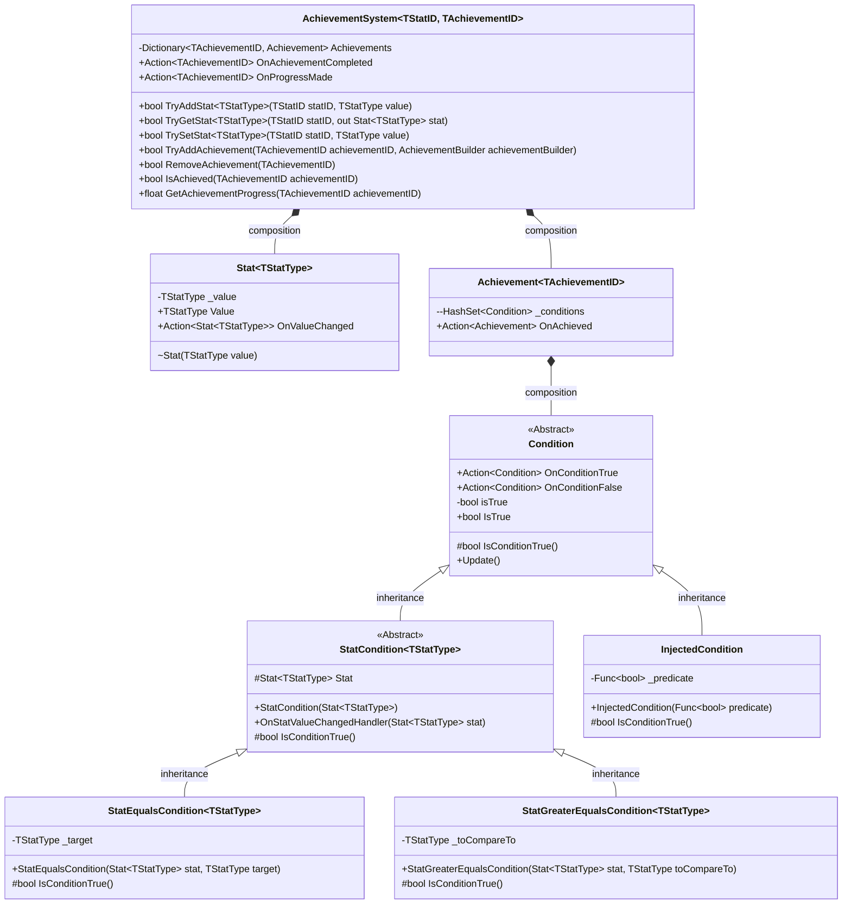
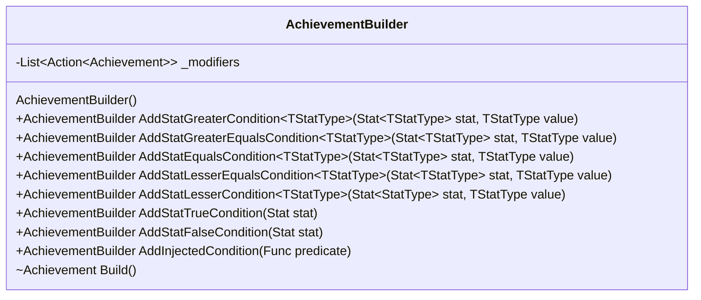

```mermaid
classDiagram

class AchievementSystem~TStatID, TAchievementID~
AchievementSystem : -Dictionary~TAchievementID, Achievement~ Achievements
AchievementSystem : +Action~TAchievementID~ OnAchievementCompleted
AchievementSystem : +Action~TAchievementID~ OnProgressMade
AchievementSystem : +bool TryAddStat~TStatType~(TStatID statID, TStatType value)
AchievementSystem : +bool TryGetStat~TStatType~(TStatID statID, out Stat~TStatType~ stat)
AchievementSystem : +bool TrySetStat~TStatType~(TStatID statID, TStatType value)
AchievementSystem : +bool TryAddAchievement(TAchievementID achievementID, AchievementBuilder achievementBuilder)
AchievementSystem : +bool RemoveAchievement(TAchievementID)
AchievementSystem : +bool IsAchieved(TAchievementID achievementID)
AchievementSystem : +float GetAchievementProgress(TAchievementID achievementID)

class Stat~TStatType~
AchievementSystem *-- Stat : composition
Stat : -TStatType _value
Stat : +TStatType Value
Stat : ~Stat(TStatType value)
Stat : +Action~Stat~TStatType~~ OnValueChanged

class Achievement~TAchievementID~
AchievementSystem *-- Achievement : composition
Achievement : --HashSet~Condition~ _conditions
Achievement : +Action~Achievement~ OnAchieved

class Condition
<<Abstract>> Condition
Achievement *-- Condition : composition
Condition : +Action~Condition~ OnConditionTrue
Condition : +Action~Condition~ OnConditionFalse
Condition : -bool isTrue
Condition : +bool IsTrue
Condition : #bool IsConditionTrue()
Condition : +Update()

class StatCondition~TStatType~
<<Abstract>> StatCondition
Condition <|-- StatCondition : inheritance
StatCondition : #Stat~TStatType~ Stat
StatCondition : +StatCondition(Stat~TStatType~)
StatCondition : +OnStatValueChangedHandler(Stat~TStatType~ stat)
StatCondition : #bool IsConditionTrue()

class InjectedCondition
Condition <|-- InjectedCondition : inheritance
InjectedCondition : -Func~bool~ _predicate
InjectedCondition : +InjectedCondition(Func~bool~ predicate)
InjectedCondition : #bool IsConditionTrue()

class StatEqualsCondition~TStatType~
StatCondition <|-- StatEqualsCondition : inheritance
StatEqualsCondition : -TStatType _target
StatEqualsCondition : +StatEqualsCondition(Stat~TStatType~ stat, TStatType target)
StatEqualsCondition : #bool IsConditionTrue()

class StatGreaterEqualsCondition~TStatType~
StatCondition <|-- StatGreaterEqualsCondition :inheritance
StatGreaterEqualsCondition : -TStatType _toCompareTo
StatGreaterEqualsCondition : +StatGreaterEqualsCondition(Stat~TStatType~ stat, TStatType toCompareTo)
StatGreaterEqualsCondition : #bool IsConditionTrue()
```

```mermaid
classDiagram

class AchievementBuilder
AchievementBuilder : -List~Action~Achievement~~ _modifiers
AchievementBuilder : AchievementBuilder()
AchievementBuilder : +AchievementBuilder AddStatGreaterCondition~TStatType~(Stat~TStatType~ stat, TStatType value)
AchievementBuilder : +AchievementBuilder AddStatGreaterEqualsCondition~TStatType~(Stat~TStatType~ stat, TStatType value)
AchievementBuilder : +AchievementBuilder AddStatEqualsCondition~TStatType~(Stat~TStatType~ stat, TStatType value)
AchievementBuilder : +AchievementBuilder AddStatLesserEqualsCondition~TStatType~(Stat~TStatType~ stat, TStatType value)
AchievementBuilder : +AchievementBuilder AddStatLesserCondition~TStatType~(Stat~StatType~ stat, TStatType value)
AchievementBuilder : +AchievementBuilder AddStatTrueCondition(Stat<bool> stat)
AchievementBuilder : +AchievementBuilder AddStatFalseCondition(Stat<bool> stat)
AchievementBuilder : +AchievementBuilder AddInjectedCondition(Func<bool> predicate)
AchievementBuilder : ~Achievement Build()
```
