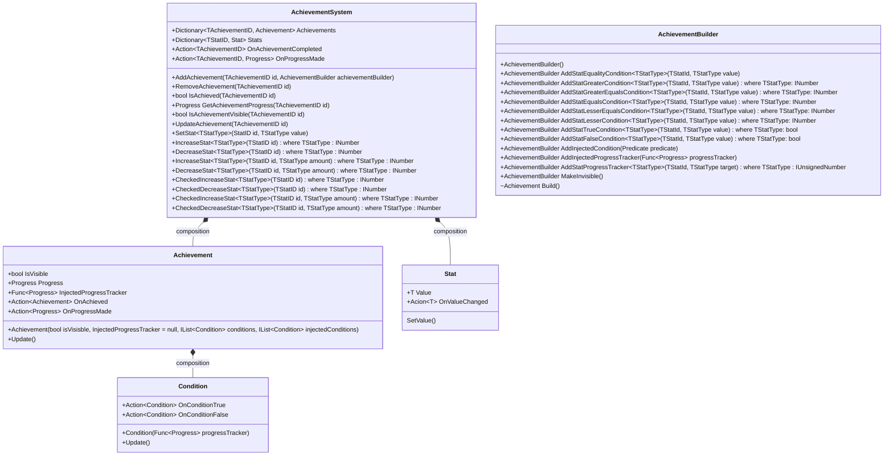

```mermaid
classDiagram
    AchievementSystem *-- Achievement : composition
    Achievement *-- Condition : composition
    AchievementSystem *-- Stat : composition

    class AchievementSystem~TStatID, TAchievementID~{
      +Dictionary~TAchievementID, Achievement~ Achievements
      +Dictionary~TStatID, Stat~ Stats
      +Action~TAchievementID~ OnAchievementCompleted
      +Action~TAchievementID, Progress~ OnProgressMade
      +AddAchievement(TAchievementID id, AchievementBuilder achievementBuilder)
      +RemoveAchievement(TAchievementID id)
      +bool IsAchieved(TAchievementID id)
      +Progress GetAchievementProgress(TAchievementID id)
      +bool IsAchievementVisible(TAchievementID id)
      +UpdateAchievement(TAchievementID id)
      +SetStat~TStatType~(StatID id, TStatType value)
      +IncreaseStat~TStatType~(TStatID id) where TStatType : INumber
      +DecreaseStat~TStatType~(TStatID id) where TStatType : INumber
      +IncreaseStat~TStatType~(TStatID id, TStatType amount) where TStatType : INumber
      +DecreaseStat~TStatType~(TStatID id, TStatType amount) where TStatType : INumber
      +CheckedIncreaseStat~TStatType~(TStatID id) where TStatType : INumber
      +CheckedDecreaseStat~TStatType~(TStatID id) where TStatType : INumber
      +CheckedIncreaseStat~TStatType~(TStatID id, TStatType amount) where TStatType : INumber
      +CheckedDecreaseStat~TStatType~(TStatID id, TStatType amount) where TStatType : INumber
    }

    class AchievementBuilder{
        +AchievementBuilder()
        +AchievementBuilder AddStatEqualityCondition~TStatType~(TStatId, TStatType value)
        +AchievementBuilder AddStatGreaterCondition~TStatType~(TStatId, TStatType value) where TStatType: INumber
        +AchievementBuilder AddStatGreaterEqualsCondition~TStatType~(TStatId, TStatType value) where TStatType: INumber
        +AchievementBuilder AddStatEqualsCondition~TStatType~(TStatId, TStatType value) where TStatType: INumber
        +AchievementBuilder AddStatLesserEqualsCondition~TStatType~(TStatId, TStatType value) where TStatType: INumber
        +AchievementBuilder AddStatLesserCondition~TStatType~(TStatId, TStatType value) where TStatType: INumber
        +AchievementBuilder AddStatTrueCondition~TStatType~(TStatId, TStatType value) where TStatType: bool
        +AchievementBuilder AddStatFalseCondition~TStatType~(TStatId, TStatType value) where TStatType: bool
        +AchievementBuilder AddInjectedCondition(Predicate predicate)
        +AchievementBuilder AddInjectedProgressTracker(Func~Progress~ progressTracker)
        +AchievementBuilder AddStatProgressTracker~TStatType~(TStatId, TStatType target) where TStatType : IUnsignedNumber
        +AchievementBuilder MakeInvisible()
        ~Achievement Build()
    }

    class Stat~T~{
        +T Value
        SetValue()
        +Acion~T~ OnValueChanged
    }

    class Achievement{
        +bool IsVisible
        +Progress Progress
        +Func~Progress~ InjectedProgressTracker
        +Action~Achievement~ OnAchieved
        +Action~Progress~ OnProgressMade
        +Achievement(bool isVisisble, InjectedProgressTracker = null, IList~Condition~ conditions, IList~Condition~ injectedConditions)
        +Update()
    }

    class Condition{
        +Action~Condition~ OnConditionTrue
        +Action~Condition~ OnConditionFalse
        +Condition(Func~Progress~ progressTracker)
        +Update()
    }
```
